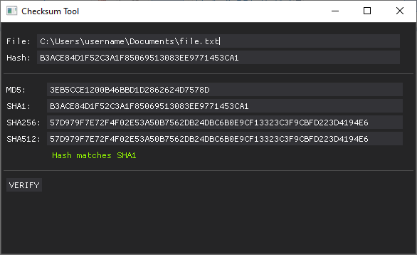
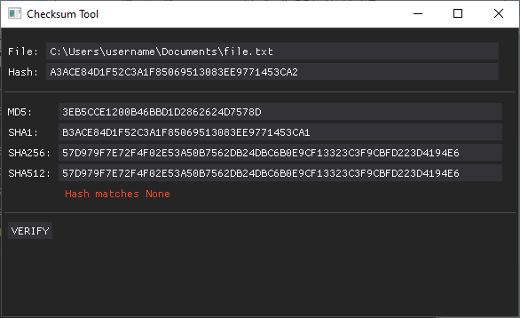

# checksum-tool
Simple checksum tool built with DearPyGui in Python 3.x

## Built With
- [Python 3.x](python.org) with the help these Python modules:
    - hashlib (built-in)
    - [DearPyGUI](https://dearpygui.readthedocs.io/en/latest/index.html)

## How it Works
1. Run `checksum_tool.pyw` (assuming Python 3.x and DearPyGUI are installed)
2. Paste the location of the file.
3. Paste the hash.
4. Click ``VERIFY``
5. Program spits out what it found. See below for examples.

If the hash matches any of checksums:

If the hash didn't match any of the checksums:

## License 
Distributed under the MIT License. See `LICENSE` for more information.
